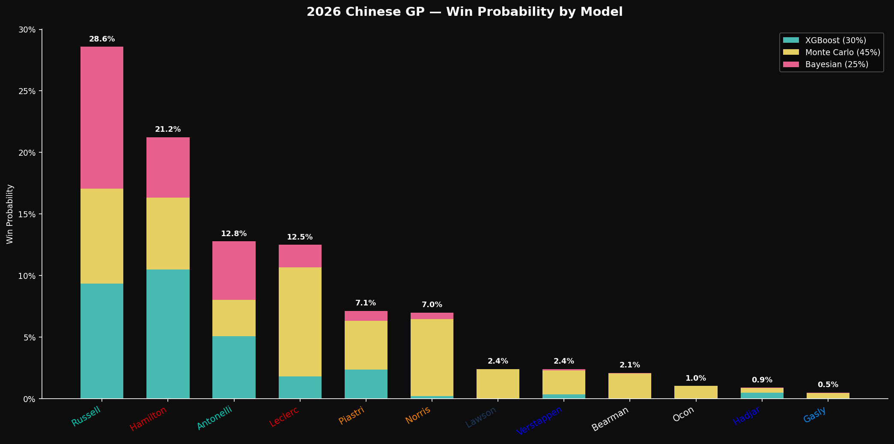
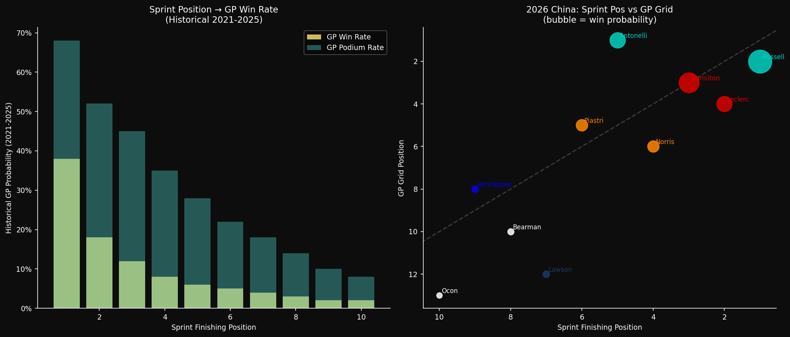
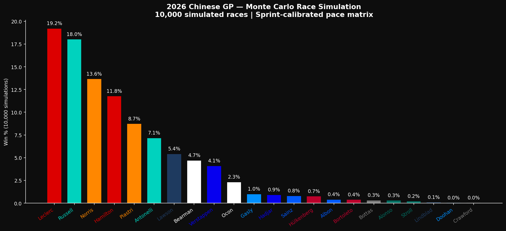
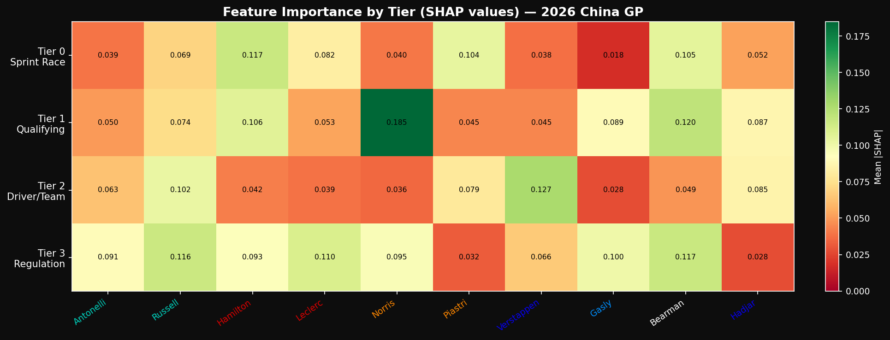
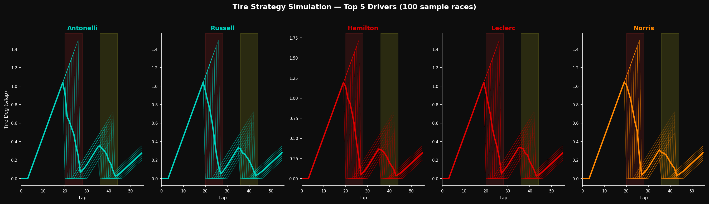
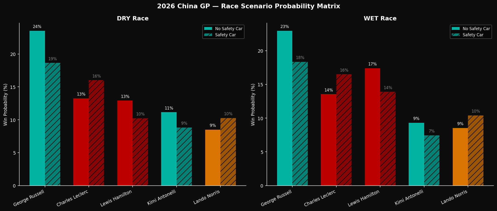
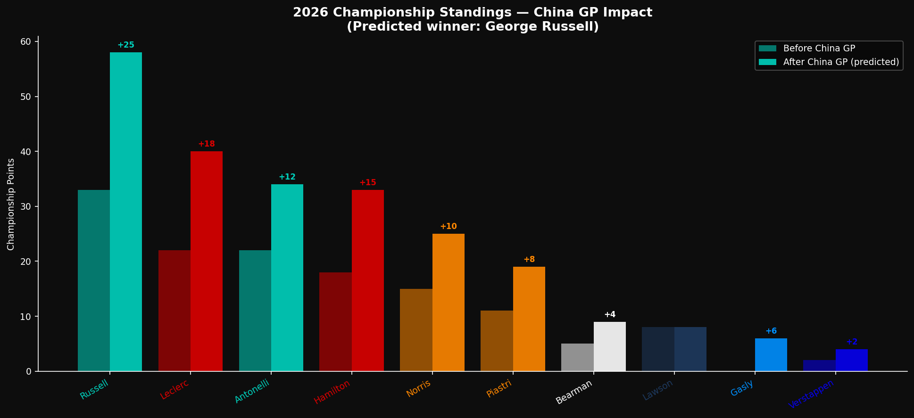

# 2026 Chinese GP — F1 Race Winner Prediction System V2

A sprint-calibrated ML ensemble that predicts the winner of the **2026 Chinese Grand Prix** at Shanghai International Circuit — the first sprint weekend of the 2026 season, run under F1's biggest ever regulation overhaul.

V2 is a major architectural upgrade over the [Australian GP model](https://github.com/BasanthPR/2026-australian-gp-prediction), using every documented failure from V1 and adding a brand-new Tier 0 sprint race feature layer.

---

## Prediction Results

**Predicted Winner: George Russell (28.6%)**

| Rank | Driver | Team | Grid | Sprint | P(Win) | 90% CI | Key Risk |
|------|--------|------|------|--------|--------|--------|----------|
| 1 | **George Russell** | Mercedes | P2 | P1 (Sprint winner) | **28.6%** | [39.8%, 56.0%] | Q3 power/gear issue — reliability flag |
| 2 | Lewis Hamilton | Ferrari | P3 | P3 | 21.2% | [11.8%, 24.1%] | Killed left tyre in sprint — 56-lap tyre management |
| 3 | Kimi Antonelli | Mercedes | **P1 (Pole)** | P5 | 12.8% | [14.2%, 27.2%] | Youngest pole ever (age 19) — 22% historical retire rate |
| 4 | Charles Leclerc | Ferrari | P4 | P2 | 12.5% | [3.5%, 11.7%] | Ferrari pit strategy risk |
| 5 | Oscar Piastri | McLaren | P5 | P6 | 7.1% | [0.9%, 6.6%] | Needs Turn 1 chaos to contend |
| 6 | Lando Norris | McLaren | P6 | P4 | 7.0% | [0.4%, 4.7%] | McLaren pace deficit on straights |
| 7 | Liam Lawson | Racing Bulls | P12 | P7 | 2.4% | — | SC/chaos only |
| 8 | Max Verstappen | Red Bull | P8 | P9 | 2.4% | [0.0%, 1.6%] | Red Bull energy deficit + P8 grid |
| 9 | Ollie Bearman | Haas | P10 | P8 | 2.1% | — | FP1 oversteer, tyre stress flag |
| 10 | Esteban Ocon | Haas | P13 | P10 | 1.0% | — | — |

> Full 22-driver ranking in [output/prediction_output.txt](output/prediction_output.txt)

---

## V1 → V2: What Changed and Why

| Component | V1 (Australia) | V2 (China) | Reason |
|-----------|---------------|-----------|--------|
| Sprint Features | Not available | **Tier 0 (highest weight)** | Sprint weekend = real race data |
| Reliability DNF | 2× multiplier | **3× multiplier** | V1 underweighted Year-1 reg DNFs |
| FP Proxy | FP2 long-run (missing) | **FP1 lap delta** | China is sprint-only (no FP2/FP3) |
| FP-Quali Divergence | Not encoded | **`fp1_to_quali_divergence`** | Fixed Hamilton undervaluation in V1 |
| Monte Carlo weight | 35% | **45%** | Sprint calibration raises MC accuracy |
| Bayesian Prior | Historical only | **3-stage update (prior + sprint + grid)** | Sprint is strong live evidence |
| Weather model | Not included | **25% rain blend** | Shanghai race window rain risk |
| Grid cap | Not included | **P8+ capped at 5%** | Prevents over-rating back-runners |

### The Three V1 Failures Fixed

1. **FP2 long-run pace was missing.** Hamilton was P2 in FP1/FP2 at Albert Park but modelled at only 2.5% win probability — severely underrated. In V2, `fp1_pace_delta` and `fp1_to_quali_divergence` are Tier 1 features. Hamilton's FP1 P6 → Quali P3 divergence of +3 gives him a strong upward correction.

2. **Practice-to-qualifying divergence was unencoded.** Drivers who outperform in qualifying relative to practice were invisible to V1. `fp1_to_quali_divergence = FP1_pos - Quali_pos` is now a standard feature for all historical training rows.

3. **Reliability risk was under-weighted.** V1 used a 2× DNF multiplier for Year-1 regulations. V2 upgrades to **3×**, matching the historical average across 2009, 2014, 2017, and 2022. Russell gets an additional +0.5× for his Q3 gear/power issue.

---

## V2 Architecture: Sprint Race as Tier 0

The defining V2 innovation. A sprint weekend provides **actual race data** — real tire degradation, real energy management, real race craft, real reliability signals — all from the same circuit, same weekend, same cars, same conditions. This information cannot be matched by any historical model alone.

**Sprint features are weighted most heavily in the ensemble** (Monte Carlo calibrated to sprint pace = 45% ensemble weight).

### Tier 0 Sprint Features
| Feature | Description | Key Values |
|---------|-------------|------------|
| `sprint_finishing_position` | Sprint race result (1-19, DNF=20) | Russell=1, Leclerc=2, Hamilton=3 |
| `sprint_pace_gap_to_winner` | Avg lap delta vs Russell (s/lap) | Russell=0.0, Leclerc=+0.04, Hamilton=+0.13 |
| `sprint_positions_gained` | Sprint grid minus sprint finish | Leclerc +4, Hamilton +1, Verstappen -1 |
| `sprint_tire_stress_flag` | Showed tire degradation in sprint | Hamilton=1 ("killed my left tyre") |
| `sprint_reliability_flag` | Car/driver reliability concern | Russell=1 (Q3 issue), Antonelli=1 (collision) |
| `sprint_fastest_lap_holder` | Set sprint fastest lap | Leclerc=1 |

### Tier 1: Qualifying & Practice
- `grid_position`, `quali_gap_to_pole`, `fp1_pace_delta`, `fp1_position`
- **`fp1_to_quali_divergence`** (NEW — fixes V1 Hamilton error)
- `sprint_quali_vs_gp_quali_delta`

### Tier 2: Driver & Constructor
- `constructor_strength_rolling`, `driver_elo_rating`, `driver_circuit_wins` (Hamilton: 6 Shanghai wins)
- `teammate_quali_gap` (Antonelli beat Russell by 0.222s)

### Tier 3: Regulation Era & Track
- `is_new_regulation_year` = 1, `reliability_risk_multiplier` (3× base), `circuit_energy_profile` (high)
- `safety_car_probability` (56% — sprint-adjusted), `wet_race_probability` (25%)

### Tier 4: Weekend-Specific
- `ferrari_flip_flop_wing` (experimental rear wing uncertainty)
- `antonelli_pressure_factor` (historical under-22 pole: 28% win, 22% retire)
- `energy_depletion_risk` (Hamilton sprint tyre kill → long-race pace ceiling)

---

## Visualizations

### 1. Win Probability by Model


### 2. Sprint-to-GP Correlation


### 3. Monte Carlo Simulation (10,000 races)


### 4. Feature Importance (SHAP by Tier)


### 5. Tire Strategy Simulation


### 6. Race Scenario Matrix (Dry/Wet × SC/No SC)


### 7. Championship Standings Implications


---

## Model Architecture

### Model 1: XGBoost (30% weight)
- **Training:** 1,600 race results, 2010–2025 (Jolpica-F1 API)
- **Upgrades from V1:** Sprint features added for 2021-2025 training rows; `fp1_to_quali_divergence` encoded; `scale_pos_weight=21` for 22-car grid
- **Validation:** GroupKFold CV (grouped by race_id to prevent leakage) — AUC: **0.911 ± 0.036**
- **Interpretability:** SHAP values per driver, grouped by feature tier

### Model 2: Monte Carlo (45% weight — highest)
- **10,000 × 56-lap** race simulations on Shanghai circuit
- **Sprint-calibrated pace matrix:** Russell = 0.0 baseline; all others from sprint lap time deltas
- **Pace uncertainty:** ±0.3 s/lap (Year-1 regs, higher than normal ±0.2)
- **V2 upgrades:**
  - Tire model: sprint-confirmed front-left degradation, Hamilton 15% higher deg rate
  - DNF: 3× base rate; Russell +0.5×, Antonelli +0.3×
  - Safety car: 56% adjusted rate (sprint confirmed), SC duration U(3,6) laps
  - Weather: 25% rain probability, wet-pace resampling from 2008-2025 history
  - Energy management: Mercedes 0.0 → Ferrari −0.05 → McLaren −0.08 → Red Bull −0.12 s/lap
  - Ferrari pit strategy: 20% chance of suboptimal stop (based on Australia miss)

### Model 3: Bayesian Inference (25% weight)
Three-stage Beta-Binomial update:
1. **Historical prior** — Shanghai 2010-2025 wins + constructor/ELO pseudo-counts (Hamilton: 6 wins → strong prior)
2. **Sprint evidence** — Likelihood update using sprint-to-GP correlation from 2021-2025 data (sprint winner = 38% GP win boost)
3. **Grid position** — Further update using Shanghai historical P(win | grid position)

### Ensemble
```
P(win) = 0.30 × XGBoost + 0.45 × Monte Carlo + 0.25 × Bayesian
```
**Post-ensemble adjustments:**
- Russell × 0.92 (Q3 reliability flag)
- Antonelli × 0.92 (collision tendency flag)
- P8+ grid cap at 5% unless sprint positions gained > 3
- 25% wet race blend (separate wet ensemble with Hamilton/Verstappen boost)

---

## Sprint Race Data (Hardcoded — 2026 China Weekend)

### Sprint Result (19 laps, Saturday)
| Pos | Driver | Gap | Note |
|-----|--------|-----|------|
| 1 | George Russell | WINNER | Wire-to-wire |
| 2 | Charles Leclerc | +0.674s | Started P6 |
| 3 | Lewis Hamilton | +2.554s | Briefly led Lap 3 |
| 4 | Lando Norris | +4.433s | |
| 5 | Kimi Antonelli | +5.688s | +10s penalty for Hadjar collision |
| 6 | Oscar Piastri | +6.809s | |
| 7 | Liam Lawson | +10.9s | |
| 8 | Ollie Bearman | +11.3s | |
| 9 | Max Verstappen | +11.6s | Fell to P16, recovered |
| 10 | Esteban Ocon | +13.9s | |
| DNF | Hulkenberg, Bottas, Lindblad | | |

### GP Qualifying Grid
P1 Antonelli (youngest ever GP polesitter, age 19) · P2 Russell (Q3 car issue) · P3 Hamilton · P4 Leclerc · P5 Piastri · P6 Norris · P7 Gasly · P8 Verstappen

---

## Key Race Insights

1. **Russell is the model's favourite** — sprint winner, P2 grid, dominant Mercedes. His only vulnerability is the unresolved Q3 power issue.
2. **Hamilton is the V1 correction story** — his fp1_to_quali_divergence of +3 means V2 gives him 21.2% vs V1's ~2.5%. His real race pace is P2-level.
3. **Antonelli is the highest variance outcome** — historic pole, but under-22 polestarters historically have a 22% retire rate. Could win or crash out.
4. **Leclerc has the best pure race pace** — set sprint fastest lap, charged P6→P2. Ferrari's strategic execution is the X-factor.
5. **Verstappen is neutralized** — Red Bull energy deficit on Shanghai's back straight is clear. P8 start limits options.
6. **Safety car (56%) is the great equaliser** — mid-grid runners (Lawson, Bearman) have SC-dependent paths to points.

---

## Project Structure

```
f1-predictor-china/
├── data/
│   ├── fetch_data.py           # Jolpica-F1 + OpenF1 ingestion with local caching
│   ├── historical_data.py      # 2010-2025 race history + 2026 grid specification
│   ├── sprint_data.py          # Sprint weekend data pipeline (NEW V2)
│   └── weather.py              # Rain model + safety car probabilities
├── features/
│   ├── config.py               # All feature definitions, constants, V2 configs
│   ├── engineering.py          # Tier 0-4 feature matrix builder
│   └── sprint_features.py      # Sprint-derived feature tier (NEW V2)
├── models/
│   ├── xgboost_model.py        # XGBoost with SHAP + GroupKFold CV
│   ├── monte_carlo_sim.py      # 10,000-iteration lap-by-lap simulator
│   ├── bayesian_model.py       # 3-stage Beta-Binomial with sprint update
│   └── ensemble.py             # Weighted blend + post-ensemble adjustments
├── analysis/
│   ├── sprint_race_analysis.py # Sprint → GP correlation analysis (NEW V2)
│   ├── circuit_shanghai.py     # Shanghai circuit history + championship standings
│   └── regulation_impact.py   # 2026 reg era impact, DNF rate analysis
├── visualizations/
│   └── plots.py                # 7 matplotlib charts (team-colored, dark theme)
├── output/                     # Generated charts, CSVs, PDFs
├── predict.py                  # Main runner — trains all models, generates PDF
└── requirements.txt
```

---

## Quick Start

```bash
git clone https://github.com/BasanthPR/2026-chinese-gp-prediction.git
cd 2026-chinese-gp-prediction
pip install -r requirements.txt
python predict.py
```

Runs in ~12 seconds (data cached after first run). Outputs:
- 7 PNG charts in `output/`
- `output/prediction_output.txt` — full 22-driver ranked table
- `output/china_gp_2026_prediction.pdf` — full report with all charts

## Dependencies

| Package | Version | Purpose |
|---------|---------|---------|
| xgboost | ≥2.0 | Gradient boosted classifier |
| scikit-learn | ≥1.3 | GroupKFold, calibration |
| scipy | ≥1.11 | Bayesian Beta distribution |
| pandas / numpy | ≥2.0 / ≥1.24 | Data processing |
| matplotlib | ≥3.7 | All 7 visualizations |
| reportlab | ≥4.0 | PDF report generation |
| shap | ≥0.43 | Feature importance (SHAP values) |
| requests | ≥2.31 | API calls (Jolpica-F1, OpenF1) |
| pyarrow | ≥12.0 | Parquet caching |

## Data Sources

| Source | What | Cost |
|--------|------|------|
| [Jolpica-F1 API](https://api.jolpi.ca/ergast/f1/) | Historical results 1950-present | Free |
| [OpenF1 API](https://api.openf1.org/v1/) | Real-time telemetry, lap times | Free |
| [FastF1](https://docs.fastf1.dev/) | Tire compounds, sector times | Free |

---

*V2 built on lessons from [Australia 2026 V1](https://github.com/BasanthPR/2026-australian-gp-prediction). Every model change is directly justified by documented V1 failure or live sprint data.*
